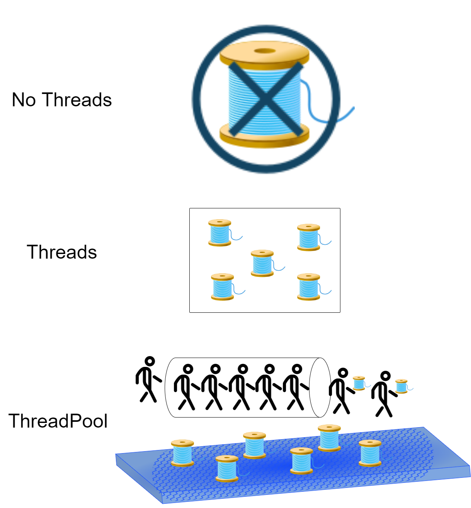

# OOP.Assignment2

## PART A

## Brief  
we created numbers of files and compute number lines for each file ,
by using 3 methods:

1. normal method without using thread
2. used threads
3. used ThreadPool

The following tables show 3 scenarios in each scenario are measured
3 methods on fixed amounts of files In ascending order of lines per file

### Scenario 1: Up to 10 lines in a single file
`Ex2_1.createTextFiles(10000, 1, 10);`

|                             |  10000 Files |  1000 Files | 100 Files | 10 Files | 
|----------------------------:|-------------:|------------:|----------:|---------:|
|           `getNumOfLines()` | 9 sec 478 ms |      167 ms |    152 ms |    86 ms |
|    `getNumOfLinesThreads()` | 1 sec 733 ms |      228 ms |     61 ms |    47 ms | 
| `getNumOfLinesThreadPool()` |  2 sec 90 ms |      228 ms |     55 ms |    47 ms |
 |               `total lines` |        45309 |        4738 |       476 |       57 | 

### Scenario 2: Up to 100 lines in a single file
`Ex2_1.createTextFiles(10000, 1, 100);`

|                                        |   10000 Files |   1000 Files | 100 Files | 10 Files |
|---------------------------------------:|--------------:|-------------:|----------:|---------:|
|                      `getNumOfLines()` | 13 sec 709 ms | 1 sec 601 ms |    448 ms |    95 ms |
|               `getNumOfLinesThreads()` |  1 sec 632 ms |       255 ms |     78 ms |    48 ms |
|            `getNumOfLinesThreadPool()` |    2 sec 8 ms |       210 ms |     65 ms |   48 ms  |
|                          `total lines` |        499039 |        50698 |      4956 |      457 |

### Scenario 3: Up to 1000 lines in a single file
`Ex2_1.createTextFiles(10000, 1, 1000);`

|                                  |   10000 Files |   1000 Files | 100 Files |  10 Files |
|---------------------------------:|--------------:|-------------:|----------:|----------:|
|                `getNumOfLines()` | 55 sec 304 ms | 6 sec 800 ms |    649 ms |    110 ms |
|         `getNumOfLinesThreads()` |  1 sec 835 ms |       289 ms |    100 ms |     42 ms |
|      `getNumOfLinesThreadPool()` |  2 sec 251 ms |       286 ms |    103 ms |     54 ms |
|                    `total lines` |       5005739 |       508498 |     51056 |     6657  |

### Conclusions

It can be seen that the more files there are, and the more lines there are in each file,

the more the functions that use threads are significantly faster than the normal function

that does not use threads. Another thing, you can notice that the third function that           

uses threadpool, takes a little more time than the second function.

We assume that this is the case because both use more or less the same number of threads,

but we pay the overhead of creating the threadpool and operating it.

## UML

## Languages and Tools

 

  <code></code>
 <code></code>
 <code></code>
  

